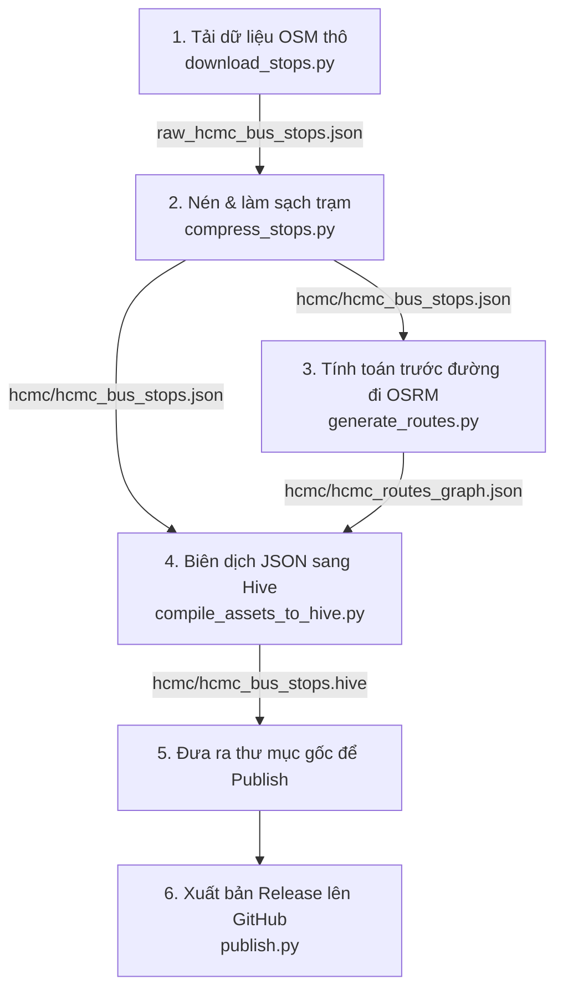

# CityFlow Assets & Data Processing Pipeline

Kho lưu trữ này lưu trữ các asset bản đồ thô, đồ thị di chuyển đường bộ (routing graph) và tệp mô tả `assets_manifest.json` của game **CityFlow / City Bus Connect**. Đồng thời, đây cũng là nơi quản lý toàn bộ quy trình tiền xử lý dữ liệu địa lý cho các thành phố.

---

## 🛠 Quy trình Tiền xử lý & Xuất bản Dữ liệu (Workflow)



### Bước 1: Tải dữ liệu thô tự động (Download Raw OSM Data)
Chạy script để tự động tải danh sách trạm xe buýt từ Overpass API về thư mục của thành phố tương ứng:
```bash
python download_stops.py --city hcmc
```
- **Xử lý lỗi HTTP 429 (Rate Limit)**: Script tự động truy cập trang trạng thái `/status` để xem khi nào có slot trống để đợi, tự động xoay tua truy vấn (rotate) qua 3 máy chủ Overpass API gương công cộng khác nhau, và áp dụng Exponential Backoff để thử lại an toàn.
- **Tùy biến**: Bạn có thể tùy biến địa danh OSM bằng tham số `--area-name` (Ví dụ: `python download_stops.py --city hcmc --area-name "Tỉnh Bình Dương"`).
*Đầu ra:* file thô lưu tại `<city>/raw_<city>_bus_stops.json`.

### Bước 2: Nén và làm sạch danh sách trạm (Clean & Compress)
Chạy script để lọc bỏ các tag không cần thiết và giảm kích thước file:
```bash
python compress_stops.py --city hcmc
```
*Đầu ra:* file sạch `<city>/<city>_bus_stops.json`.

### Bước 3: Tính toán trước các tuyến đường xe chạy (Precalculate Routing Graph)
Script này sẽ truy vấn OSRM (động cơ tìm đường lái xe) để dựng đường đi snapping theo bản đồ đường bộ giữa tất cả cặp trạm có cự ly chim bay $\le$ 4km (tương đương $\le$ 6.6km đường bộ).
```bash
python generate_routes.py --city hcmc
```
- **Tối ưu**: Script hỗ trợ cơ chế tải song song (16 luồng) và tự động khôi phục tiến trình cũ (resume cache) nếu bị gián đoạn.
- **OSRM Server**: Script tự động ưu tiên truy vấn OSRM cục bộ chạy ở `http://localhost:5000` (rất nhanh, khuyên dùng) trước khi fallback sang public API.

### Bước 4: Biên dịch JSON sang cơ sở dữ liệu nhị phân Hive (Compile to Hive)
Để game chạy mượt 60 FPS, chúng ta đóng gói các file JSON cồng kềnh sang định dạng nhị phân Hive `.hive`:
```bash
python compile_assets_to_hive.py hcmc
```
*(Quy trình chạy hoàn toàn bằng Python 3, không cần cài đặt thêm Dart SDK)*
*Đầu ra:* `<city>/<city>_bus_stops.hive` và `<city>/<city>_routes_graph.hive`.

### Bước 5: Xuất bản lên GitHub (Publish Release)
Chạy script tự động hóa để cập nhật manifest và đẩy asset lên release của GitHub:
```bash
./publish.py
```
*Quy trình tự động của `publish.py`:*
1. Tự động quét các file tài nguyên `{city_id}_map.pmtiles`, `{city_id}_routes_graph.hive`, và `{city_id}_bus_stops.hive` trực tiếp từ các thư mục thành phố tương ứng (ví dụ: `hcmc/`).
2. Tính toán mã băm SHA256 và kích thước file.
3. Nếu file có sự thay đổi, tự động tăng phiên bản (ví dụ `1.0.0` $\rightarrow$ `1.0.1`) trong `assets_manifest.json` và cập nhật đường dẫn tải về.
4. Nếu file không thay đổi, giữ nguyên URL của Release trước đó và phiên bản cũ (tiết kiệm thời gian và băng thông).
5. Tạo GitHub Release với thẻ tag (ví dụ `v1.0.2`), tự động đẩy các file có thay đổi lên thông qua GitHub CLI (`gh`).
6. Commit và push `assets_manifest.json` đã cập nhật lên nhánh `main`.

---

## 📋 Yêu cầu hệ thống (Prerequisites)

- **Python 3**: các thư viện đi kèm sẵn (`urllib`, `json`, `concurrent.futures`, `argparse`, `zlib`, `struct`).
- **GitHub CLI (`gh`)**: cài đặt trên thiết bị và đã đăng nhập bằng lệnh `gh auth login` để có quyền đẩy release lên GitHub.

---

## ⚙️ Hướng dẫn điều chỉnh & Cơ chế thuật toán tối ưu hóa (Stratified Approximation)

Khi chạy script `compile_assets_to_hive.py`, hệ thống áp dụng kỹ thuật **Stratified Approximation (Xấp xỉ phân tầng)** để tự động lọc bỏ các đường đi đối xứng trùng lặp ở các đường 2 chiều (Symmetric Deduplication) nhằm giảm dung lượng file `.hive` mà vẫn đảm bảo tính an toàn giao thông.

### Cơ sở khoa học của Thuật toán
Thay vì sử dụng thuật toán tính khoảng cách chính xác như **Fréchet Distance** hay **Hausdorff Distance** vốn có độ phức tạp thời gian cực lớn ($O(N^2)$, có thể mất hàng giờ để chạy hết 160k tuyến đường), hệ thống sử dụng bộ lọc phân tầng 2 lớp với độ phức tạp cực thấp ($O(1)$) để đạt độ chính xác ~99% trong vòng dưới 3 giây:

1. **Bộ lọc Phân tầng 1: Kiểm tra khoảng cách (`dist_threshold = 0.05` / 5%)**
   - *Logic*: So sánh độ dài thực tế của chiều đi và chiều về. Nếu chênh lệch quá 5%, hệ thống kết luận ngay lập tức đây là hai đường không đối xứng (đường một chiều rẽ vòng) và giữ lại cả hai.
   
2. **Bộ lọc Phân tầng 2: Lấy mẫu hình học 5 điểm (`geo_threshold_km = 0.05` / 50m)**
   - *Logic*: Dựa trên nguyên lý **Nyquist-Shannon sampling áp dụng vào spatial domain** và **Probabilistic Guarantee (Đảm bảo xác suất)**. Để phát hiện sự lệch làn đường (thường $\ge 300\text{ m}$ ở đô thị), hệ thống lấy mẫu đều đúng 5 điểm phân bổ dọc theo tuyến đường của cả 2 chiều (sau khi đảo chiều tọa độ) và tính khoảng cách Haversine giữa chúng.
   - Nếu khoảng cách lệch lớn nhất tại 5 điểm lấy mẫu nhỏ hơn $50\text{ m}$, hệ thống xác nhận đây là cùng một con đường hai chiều thực sự $\rightarrow$ thực hiện gộp (Deduplicate). Nếu $\ge 50\text{ m}$ (đi qua phố song song bên cạnh), hệ thống giữ lại cả hai.

### Khi nào cần điều chỉnh các con số này?
Nếu bạn mở rộng bản đồ sang các khu vực mới có mật độ giao thông và cấu trúc đô thị khác biệt (như các đô thị vệ tinh Bình Dương, Đồng Nai hoặc vùng nông thôn):

* **Khu vực có các nút giao lớn hoặc cao tốc song hành rộng hơn 50m**: 
  Nếu dải phân cách giữa hai chiều đi/về rất rộng (ví dụ trên 50m), thuật toán sẽ nhận nhầm đường đi/về là asymmetric và không gộp được. Bạn có thể tăng nhẹ `geo_threshold_km` lên `0.1` (100m) hoặc `0.15` (150m) để gộp chúng lại nhằm tối ưu bộ nhớ.
* **Khu vực đô thị cực kỳ dày đặc với các phố một chiều siêu nhỏ và siêu gần nhau (dưới 40m)**:
  Có khả năng 2 tuyến phố một chiều song song nằm quá sát nhau (dưới 50m) sẽ bị nhận diện nhầm là đường hai chiều và bị gộp (gây ra bug xe chạy ngược chiều). Lúc này, cần hạ thấp `geo_threshold_km` xuống `0.03` (30m) để bảo vệ tuyệt đối đường một chiều.
* **Khi xe buýt đi đường vòng ngoại ô quá xa**:
  Khoảng cách rẽ ở ngoại ô dài hơn nhiều so với nội thành. Bạn có thể cần điều chỉnh hạ thấp `dist_threshold` xuống `0.03` (3%) để tránh gộp nhầm các đường đi vòng lớn.

