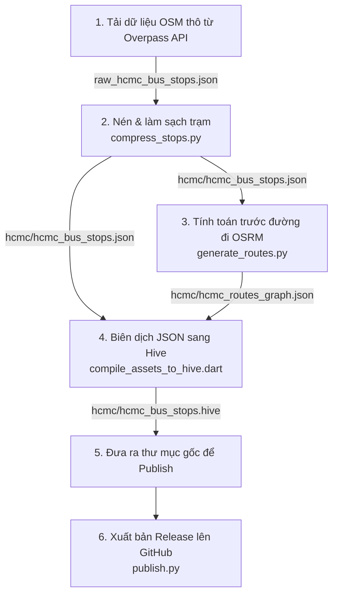

# CityFlow Assets & Data Processing Pipeline

Kho lưu trữ này lưu trữ các asset bản đồ thô, đồ thị di chuyển đường bộ (routing graph) và tệp mô tả `assets_manifest.json` của game **CityFlow / City Bus Connect**. Đồng thời, đây cũng là nơi quản lý toàn bộ quy trình tiền xử lý dữ liệu địa lý cho các thành phố.

---

## 🛠 Quy trình Tiền xử lý & Xuất bản Dữ liệu (Workflow)



### Bước 1: Tải dữ liệu thô (Raw OSM Data)
Tải danh sách các trạm xe buýt từ Overpass API cho thành phố mong muốn dưới dạng JSON và lưu vào thư mục thành phố (ví dụ: `<city>/raw_<city>_bus_stops.json`).

*Gợi ý Overpass QL Query cho TP.HCM:*
```overpassql
[out:json][timeout:25];
area["name"="Thành phố Hồ Chí Minh"]->.searchArea;
(
  node["highway"="bus_stop"](area.searchArea);
  node["public_transport"="platform"]["bus"="yes"](area.searchArea);
);
out body;
>;
out skel qt;
```

### Bước 2: Nén và làm sạch danh sách trạm (Clean & Compress)
Chạy script để lọc bỏ các tag không cần thiết và giảm kích thước file:
```bash
python compress_stops.py --city hcmc
```
*Đầu ra:* file sạch `<city>/<city>_bus_stops.json`.

### Bước 3: Tính toán trước các tuyến đường xe chạy (Precalculate Routing Graph)
Script này sẽ truy vấn OSRM (động cơ tìm đường lái xe) để dựng đường đi snapping theo bản đồ đường bộ giữa tất cả cặp trạm có cự ly chim bay $\le$ 4km (tương đương $\le$ 6.6km đường bộ).
```bash
python generate_routes.py --city hcmc
```
- **Tối ưu**: Script hỗ trợ cơ chế tải song song (16 luồng) và tự động khôi phục tiến trình cũ (resume cache) nếu bị gián đoạn.
- **OSRM Server**: Script tự động ưu tiên truy vấn OSRM cục bộ chạy ở `http://localhost:5000` (rất nhanh, khuyên dùng) trước khi fallback sang public API.

### Bước 4: Biên dịch JSON sang cơ sở dữ liệu nhị phân Hive (Compile to Hive)
Để game chạy mượt 60 FPS, chúng ta đóng gói các file JSON cồng kềnh sang định dạng nhị phân Hive `.hive`:
```bash
# Cần cài đặt Dart SDK
dart compile_assets_to_hive.dart hcmc
```
*Đầu ra:* `<city>/<city>_bus_stops.hive` và `<city>/<city>_routes_graph.hive`.

### Bước 5: Chuẩn bị file tại thư mục gốc
Copy file `.hive` và `.pmtiles` của thành phố ra thư mục gốc:
```bash
cp hcmc/hcmc_routes_graph.hive ./
# Đảm bảo có cả file map vector tương ứng
# cp <path_to_map>/hcmc_map.pmtiles ./
```

### Bước 6: Xuất bản lên GitHub (Publish Release)
Chạy script tự động hóa để cập nhật manifest và đẩy asset lên release của GitHub:
```bash
./publish.py
```
*Quy trình tự động của `publish.py`:*
1. Quét file `hcmc_map.pmtiles` và `hcmc_routes_graph.hive` ở thư mục gốc.
2. Tính toán mã băm SHA256 và kích thước file.
3. Nếu file có sự thay đổi, tự động tăng phiên bản (ví dụ `1.0.0` $\rightarrow$ `1.0.1`) trong `assets_manifest.json`.
4. Commit và push `assets_manifest.json` lên nhánh `main`.
5. Tạo GitHub Release với thẻ tag (ví dụ `v1.0.1`) và tải các asset lên đó thông qua GitHub CLI (`gh`).

---

## 📋 Yêu cầu hệ thống (Prerequisites)

- **Python 3**: các thư viện đi kèm sẵn (`urllib`, `json`, `concurrent.futures`, `argparse`).
- **Dart SDK**: dùng để chạy compiler Hive (`dart compile_assets_to_hive.dart`). Có thư viện `hive` đi kèm trong global/local cache.
- **GitHub CLI (`gh`)**: cài đặt trên thiết bị và đã đăng nhập bằng lệnh `gh auth login` để có quyền đẩy release lên GitHub.
